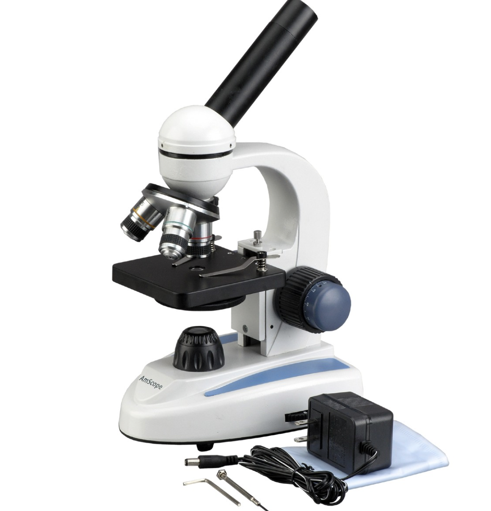

At the end of this year, I would like to share my design of a multi-nozzle tool
head. You may or may not remember that a year ago I've posted some results of
dual material 3d printing on my DIY Ultimaker 2
(<https:/plus.google.com/+XiaojunLiu/posts/4kjzNmNFms>). I said I used a
different approach which has not been implemented (at least I didn’t find)
elsewhere.

 

Well, the nozzle changing idea I came up with was inspired by the multi-lens
microscope (where three or four lenses are distributed around an axis, mounted
on a plate. To change from one to another, one can simply rotate the whole plate
so that the lens engaging is pointing towards the object).

 

 

Took this idea, I replace the lenses with nozzles. For example, given three E3D
kraken style heat breaks, heat blocks and nozzles distributes around a slightly
leaned axis, at an even angle. The axis is leaned at a certain angle to ensure
the nozzle engaged will be pointing perpendicularly towards the heated bed.

 

 

Then the heat breaks will be inserted and mounted into a single heatsink.

 

At the top of the heatsink a large 6807zz bearing is inserted to ensure the
rotation with the given axis. Actually we use two bearings for the axis to avoid
wobbling when performing the rotation.

 

 

But a free rotation is not what we want, for the engaged nozzle will rotates
away by fiction. To implement the intermittent rotation, I used the Geneva
mechanism, as you can see the Geneva wheel is fixed in the back side of the
heatsink. So that the drive gear rotates, drives the Geneva wheel rotates. And
when the engaged nozzle is printing, Geneva wheel is constrained so that the
rotation freedom is eliminated.

 

 

 

To drive the gear, many approaches can be used. For simplicity, I took the
mechanical way (inspired by the Ultimaker 3). I used a rack to drive the gear.
So that if the rack is pushed from either sides, the drive gear rotates.

 

To do that, two rods must be mounted on each sides of the printer, so that if
the tool head moves towards the end of the rod, the rack will be pushed.

Then a printed pivot part will connects these components together. The pivot
part is also good for holding all the wires and Bowden tubes, which will be
connected to the nozzles.

 

 

 

Then comes with the printed enclosure and two fans. The left axial fan is for
cooling the heatsink, and the right blower fan is for cooling the printed parts.

 

 

Finally, at the bottom a sheet metal piece is mounted to the enclosure to
prevent ooz from un-used nozzle. Also a printed shroud guides the air flow out from the
blower fan to the printed parts.

 

 

Currently the whole tool head design can be used as a module for UM2. The rack
can be pushed by two rods which are fixed on two sides of the wall of the UM2
machine.

 

 

As you may see here currently only two nozzles have been mounted. The repeat
accuracy is impressive, I’ve printed a lot of dual-extrusion models, such as the
Gyro, the traffic cone, the hand-drill and also a strandbeest I designed on
thingiverse (<https:/www.thingiverse.com/thing:3263196>).

 

I’m working on the hardware and software to make three nozzle printing possible.

 

Also, I’m trying to make this design more compact. The heatsink part needs to be
simplified, improved, for easy making. And I have not give a good name for this
tool head.

 

So please help me to improve it! Any ideas, comments, names are appreciated!
Also I’ve some spared parts, I’ll be very happy to help you to try this out.

 

Best,

XJ
