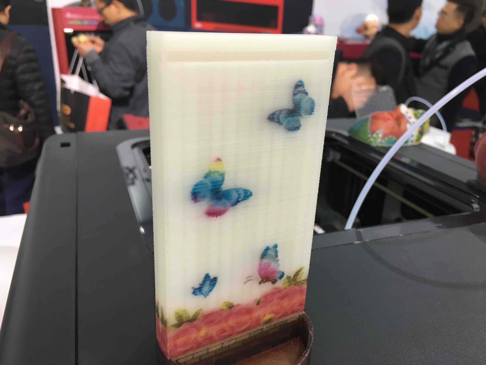
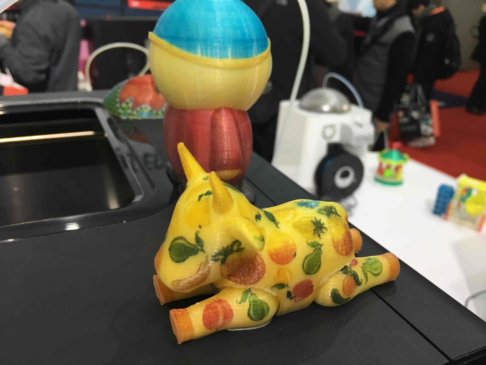
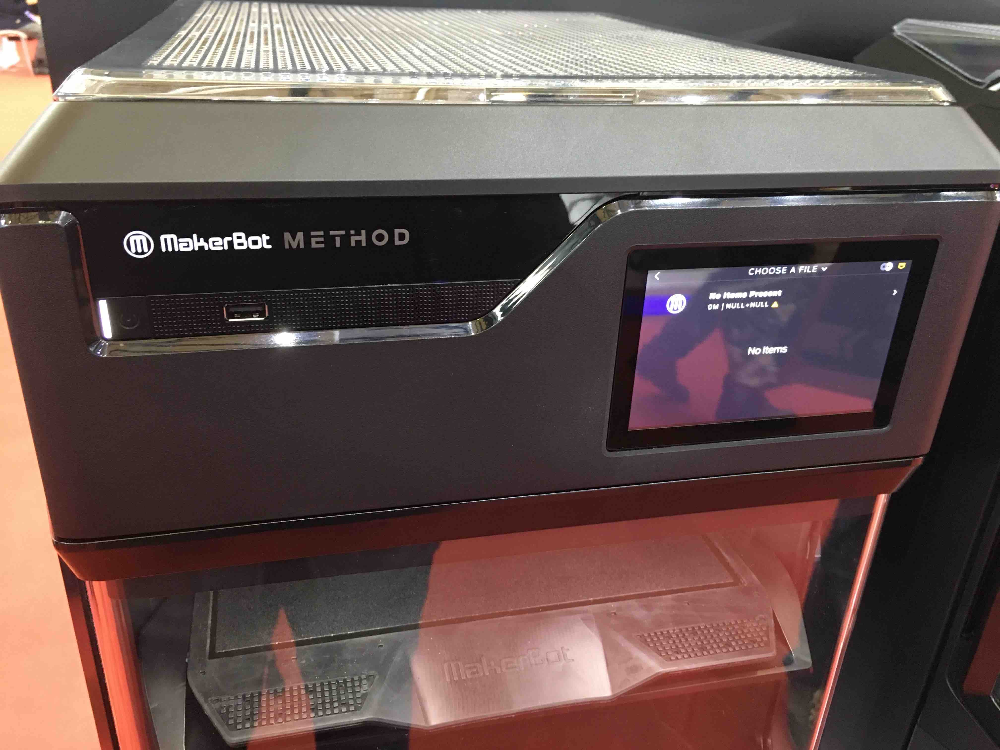
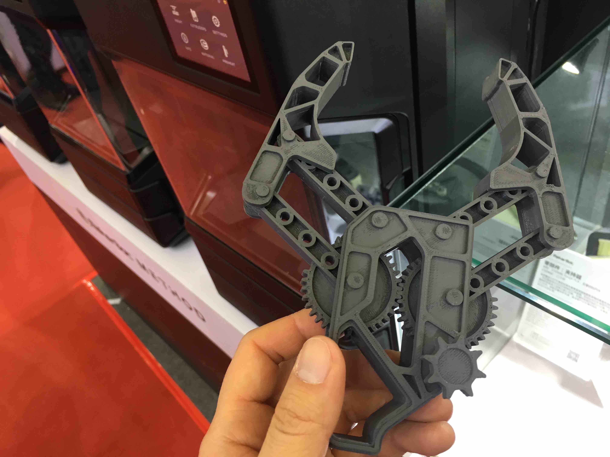
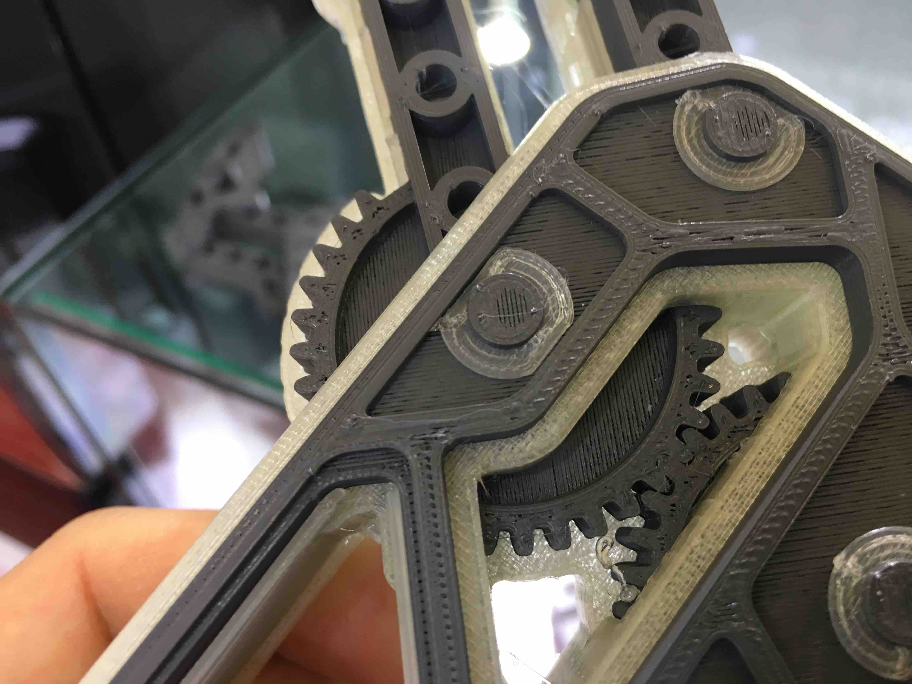
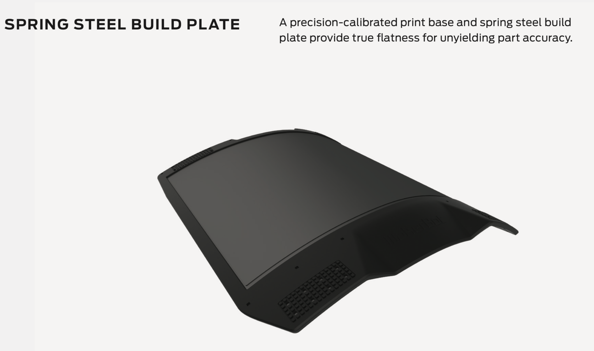
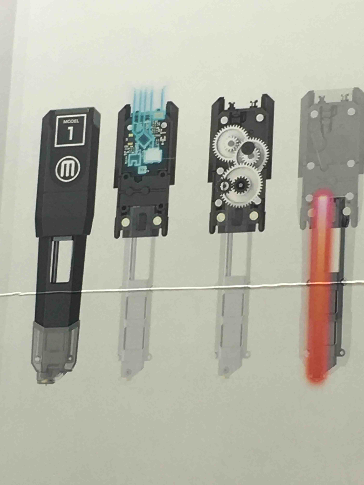

每年一度的 TCT Asia 展会又开幕了。和去年一样，今年我又打飞的来了，买了当天往返上海的机票。一出机场便直奔展会（从虹桥机场坐地铁二号线-七号线到花木路站下车）。

近两年受到广泛关注的多材料 FDM 3D 打印技术，在这次展会上当然会有所体现。所以，对我而言这次的展会比去年的展会有趣了很多。很多厂家都带来了他们的多头打印机，像 Ultimaker，Makerbot 这些大厂当然也不例外。

进入 W5 展厅以后，首先看到的就是来自台湾的 XYZprinting，和它们的全彩喷墨FDM 机型。然而，虽然是全彩，但在我看来并没有什么过人之处，颜色并不鲜艳，效果一般。

再往前走，就到了 Makerbot 的展台。这里最受关注的机型当然是 Makerbot 的新机 Method。 Method 是双头机型，有两个独立的喷头，可以加载两种不同的材料（通常左边的喷头负责打印结构部分，右边的喷头负责水溶性的支撑部分）。

本文接下来就来着重介绍我近距离观察 Makerbot Method 之后的一些感受。首先，机器的外观是很大气的，很整洁，很结实的感觉。

我最好奇的是打印头部分，打开机器的透明前面板，就可以发现两个打印头并排安装在 X 轴上，打印头并不是在同一高度的，说明 Makerbot 也许使用了和 Ultimaker 类似的升降式切换方式。打印头上有硅胶保护套包裹，防止材料熔化后附着在上面，污染打印过的部分。

值得提一下的是，Makerbot 也不例外地需要在双材料打印的时候打印换料柱！

接下来看到的就是在 Makerbot 的宣传视频中出现的机械手模型和展示配合精度的立方体模型。从打印效果来看，水溶性支撑非常完整坚固，但机械手模型的表面有欠挤出现象，上表面打印质量和我常用的 DIY UM2 类似。

Method 具有单边磁吸式前盖，可以向左打开。打开后，可以看到构建平台上面的可拆卸表层。在现场怕把平台弄坏，所以只是摸了一下这块可拆卸表面的边缘，发现边缘是类似橡胶的柔软材质。回来后从网上的资料中发现，这块可拆卸的表层的主体是弹性不锈钢材质，和 Prusa i3 的表层类似。

从外观来看，最神秘也是我最想了解的部分就是这两个大小相同的打印头了。现场的大幅宣传画上展示了打印头内部的一些细节：打印头是近程挤出的，并且用了齿轮组进行减速，值得一提的是，Makerbot 并没有像其他厂商一样采取一级减速，而是用了三个齿轮做了二级减速，拥有 19 倍的减速比。当然，减速比的增加可以减轻步进电机的压力（猜测 Makerbot 使用的电机不会是最常用的 42 步进电机，而很可能是更小的尺寸），但为了提高打印速度，也必须要提高打印机的转速，对电机提出了更高的要求。

以上就是我对 Makerbot Method 的一些看法，在后续的博文中，我们再带大家展示其它厂家的产品。

