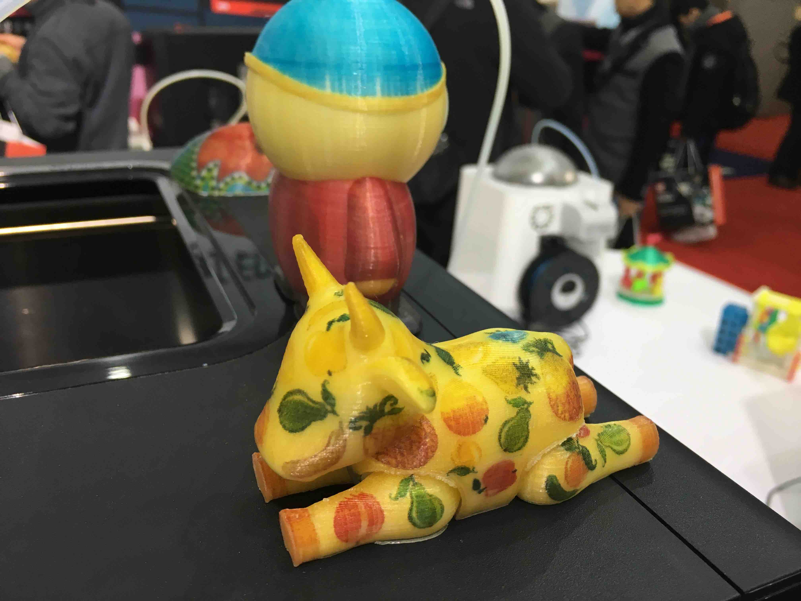
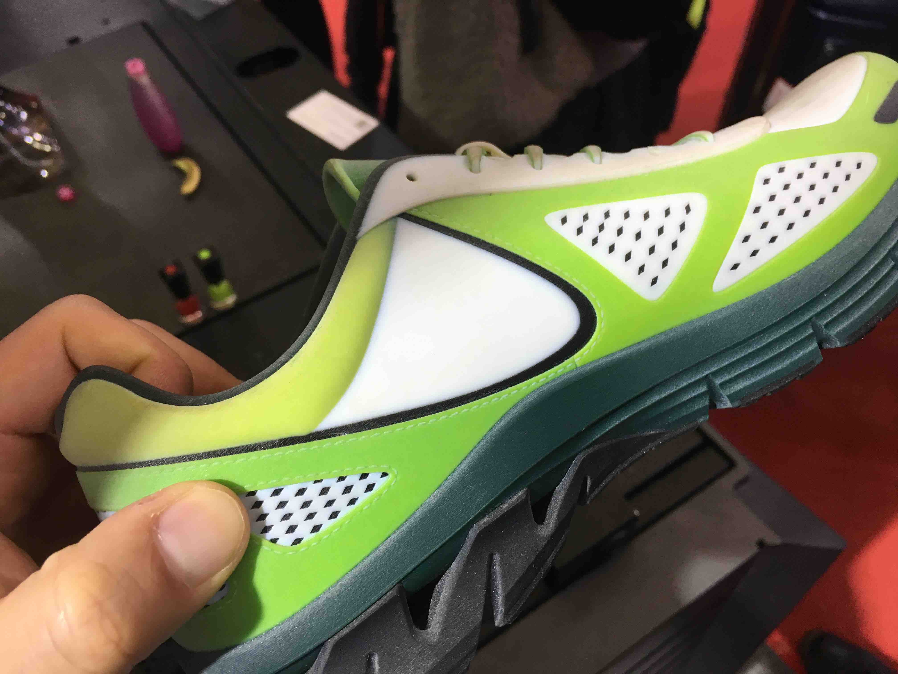
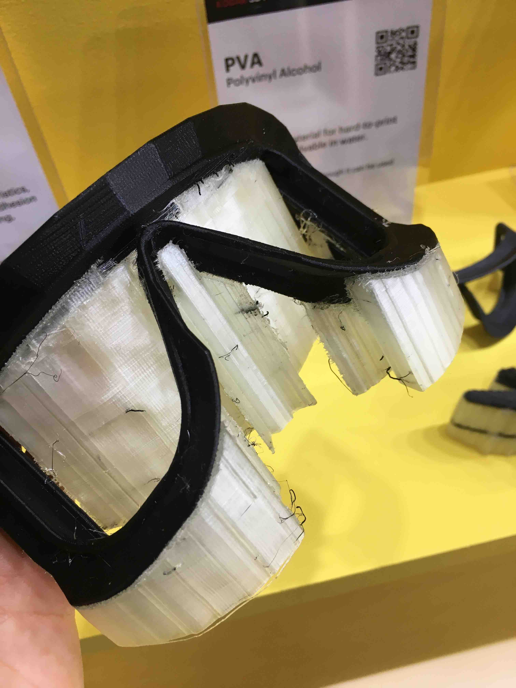
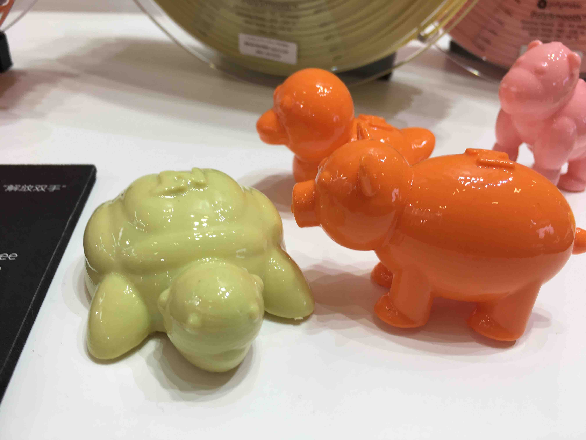
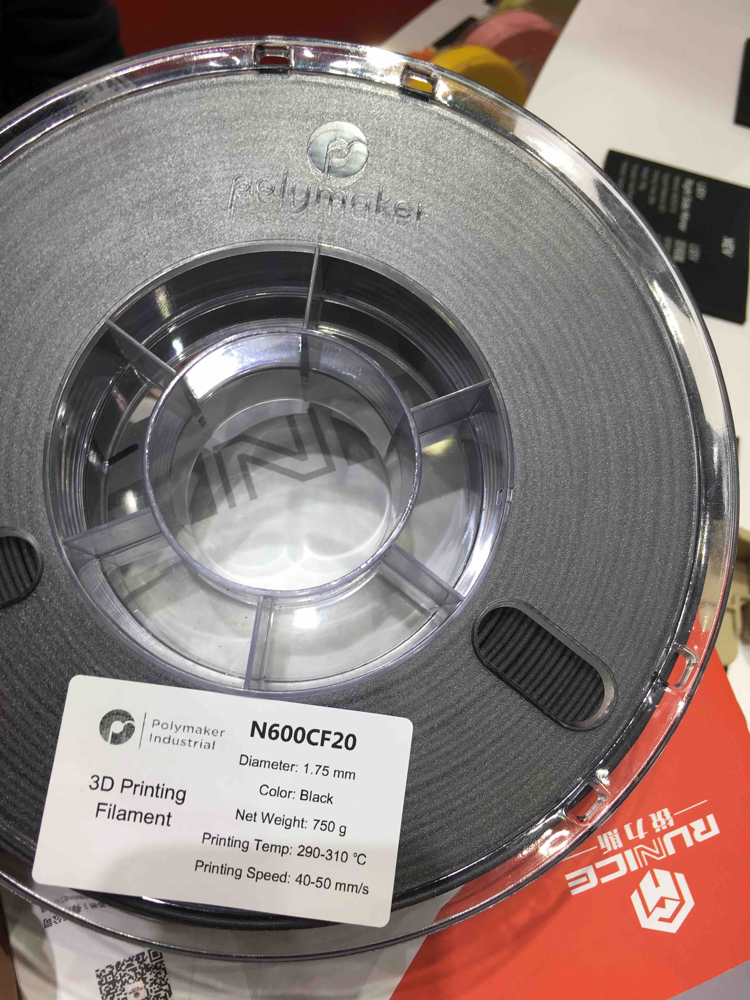
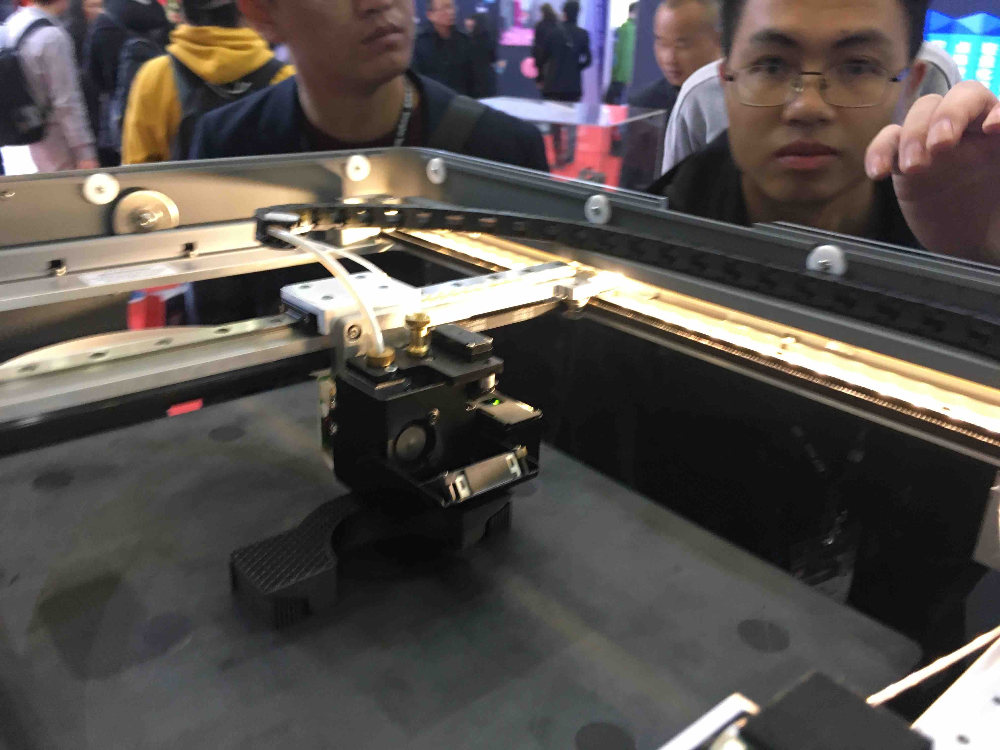
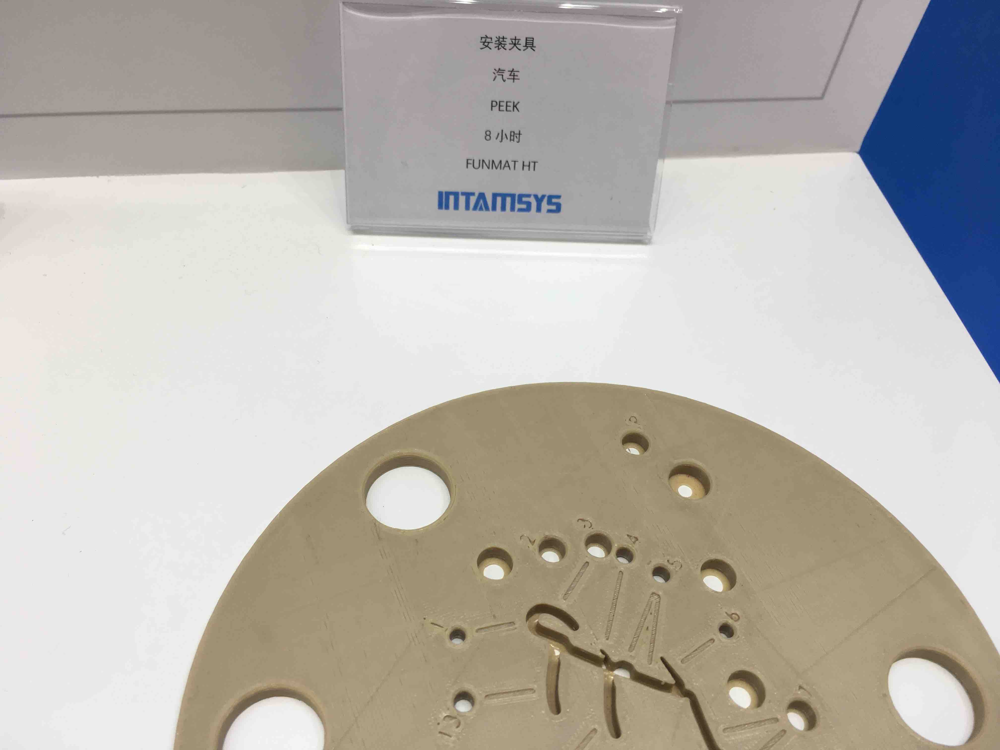

上次我们聊了聊 TCT Asia 上的 Makerbot 新机，这一次，让我们简要的说一说 对本次 TCT Asia 的其它感受。

- FDM 技术重新焕发生机

  得益于多材料打印技术的发展，去年曾经被光固化技术全面压制的 FDM 技术，今年重现生机。各大厂商都带来了它们的双材料甚至多材料 FDM 机型。在展示区也看到了大量的双色打印作品。

  

  

- 材料为王的时代已经到来

  FDM 技术并不会消亡，原因之一在于在目前多种民用技术之中，材料种类最丰富、性能最全面的可能就要数 FDM 技术了。今年各大耗材厂家也带来了他们的新产品线。

  - Polymaker 带来了 PETG, Dissolvable 两类新产品。从 Polymaker 的产品宣传手册来看，其耗材有如下几个产品线：PolyLite （满足日常使用需要的质优价廉系列，包含 PLA, ABS, PETG, PC 等种类的耗材）；PolyMax (采用了纳米增强技术的高级线材，具有优异的机械性能和打印质量，包括 PLA, PC, PETG 等种类）；PolyFlex（高质量弹性材料，包括硬度为 95A 的 TPU95 等）；PolyMide （基于尼龙材料开发的耗材，具有很高的韧性和耐温性能，值得一提的是 PolyMide CoPA 具有180摄氏度的超高耐温！）；PolyDissolve （可溶性耗材，新品）；以及 PolySmooth, PolyWood，PolyCast 等特种材料 （尤其是网上流传 PolySmooth 可以打印出具有超高透光性的产品！）

    

  - Clariant 带来了 2020 新颜色，浅粉！！当然，颜色并不是我的最爱，但 Clariant 这个品牌我一直是很有信心的，虽然其耗材售价居高不下。

  - kexcelled 也给了我很大惊喜！这个品牌有比较悠久的历史了，但这几年似乎很少发声，相对于 eSUN 还有 Polymaker 等新贵显得后劲不足。不过，今年他们在展会上也带来了很多新品。展台布置的也很有特色（各种颜色的耗材琳琅满目，甚至销售人员还表示任意色号的耗材都可以定制）。我比较关心的是高性能特种材料。在 kexcelled 的销售手册里面，我找到了这样几种有趣的材料：PETc10，这是一款具有碳纤维增强的 PET 材料。 PET 具有流动性好，层间结合性能优等特点，在 PET 中增加碳纤维应该是不错的尝试；PA6c12，这是一款以 PA6 为基材的碳纤维增强尼龙耗材，手册上宣称连续使用温度可以达到 150 度，是代替某些金属零件的不错选择。还有 PEEK 材料，在销售手册中也有介绍，但因为我的机器目前并没有可能打印 PEEK，所以就不做展开介绍了。另外值得一提的是，kexcelled 家在他们的耗材外面提供了塑料并且具有密封性的包装盒，如果用完了耗材，还可以储藏易吸水耗材，真是一物两用！

  - eSUN 当然不可不提，eSUN 有很多特种耗材，例如 PEEK，导电、带磁性、或者加入碳纤维的耗材，eSUN 和 Polymaker 已经和 Ultimaker 达成了战略联盟，将来他们的耗材参数都可以直接在 Ultimaker 的打印机上使用。

- 可媲美金属打印的 FDM — Markforged . 这家公司非常的有趣，他们使用的 FDM 技术，在每层打印传统材料之后，还会在边缘打印碳纤维长丝以增加成品的强度。我了解到所谓的碳纤维长丝，是一种类似于导线的结构，内部由几根碳纤维拧在一起，外面是一层（树脂？）涂层，打印的时候树脂部分融化和传统材料结合到一起。在 Markforged 展台，销售人员给我展示了这样打印出的成品，果然强度惊人，用手无法将打印出的部件掰弯。另外，Markforged 机器的打印效果着实令人赞叹！侧面看纹路十分整齐，上表面涂抹均匀，丝毫没有欠挤出、过挤出的现象。

- 可打印 PEEK 材料的 INTAMSYS。这家公司的喷头能加热到 400 度以上，封闭的加热仓可以加热到90度，用来打印 PEEK 材料完全可以胜任。在现场我看到了真机，摸了一下发现隔热做的还可以，机器的钣金外壳有40多度。另外，在现场还亲眼看到了 PEEK 耗材打印出的样品。

总体来说，可能是因为 FDM 技术重新焕发了生机，这届展会比去年给我留下了更深的印象，相信随着各个耗材厂商对于研发的不断投入，在明年的展会上我们可能会看到更多更好的产品，相信 FDM 不会被取代！