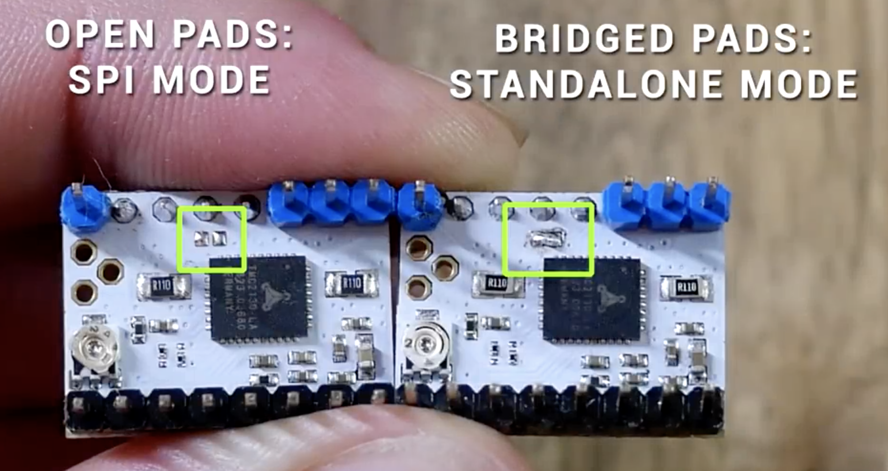
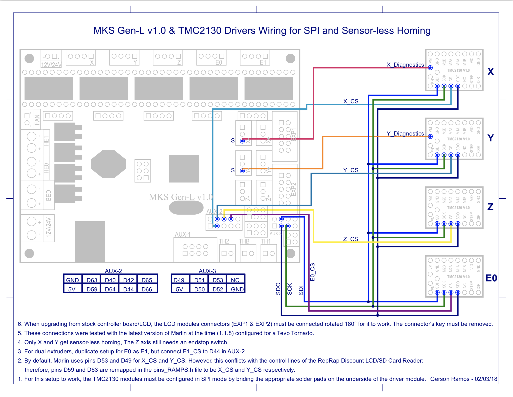
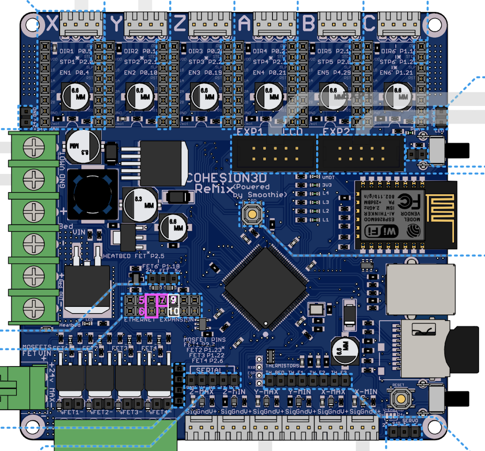

TMC2130 是一款非常有趣的步进电机驱动，最吸引我的地方是"失速检测" （Stall-detection) 功能，以及由此而来的"无传感器归零" （Homeless-sensing). 对我这个电路外行，也只有在这块驱动芯片发布多年，各种视频、资料都齐备之后，才有机会尝试. 

由于家里有很多块定制的 C3D-remix 主板[^1]，再加上最近一两年一直折腾小号的 CoreXY 机器使用的就是这块主板，因此我决定先买几块 2130 驱动，用这块主板试验一下. [^2]

注意：要使用 TMC2130 的这些功能，需要开启它的 SPI 模式，在有些驱动板上，这个模式是被禁用的，需要去掉一块焊锡才可以开启。



# 软件准备

- PlatformIO 要安装 TMC2130Stepper 的库文件(by teemuatlut). 直接搜索并安装即可

- 主板通电设置 TMC2130 工作电压（此步骤先略过）

- 固件设置的更改：

  - 在 Configuration.h 中若只在 X, Y 轴使用 TMC2130 ，则更改如下语句

    ```c++
    #define X_DRIVER_TYPE TMC2130
    #define Y_DRIVER_TYPE TMC2130
    ```

  - 在 Configuration_adv.h 中，需要开启 Software SPI 模式，将 TMC_USE_SW_SPI 前的注视取消，如下

    ```c++
      /**
       * Use software SPI for TMC2130.
       * Software option for SPI driven drivers (TMC2130, TMC2160, TMC2660, TMC5130 and TMC5160).
       * The default SW SPI pins are defined the respective pins files,
       * but you can override or define them here.
       */
      #define TMC_USE_SW_SPI
    ```

    

    另外开启 debug 功能：使用 M122 命令

    ```c++
      /**
       * Enable M122 debugging command for TMC stepper drivers.
       * M122 S0/1 will enable continous reporting.
       */
      #define TMC_DEBUG
    ```

    

  - 在 pins_COHESION3D_REMIX.h 中已经定义好了使用 GPIO pins 作为与 TMC2130 驱动板进行 SPI 通信所需要的端口，端口定义如下：

    ```c++
    //
    // Default pins for TMC software SPI
    //
    #if ENABLED(TMC_USE_SW_SPI)
      #ifndef TMC_SW_MOSI
        #define TMC_SW_MOSI    P1_16   // Ethernet Expansion - Pin 5
      #endif
      #ifndef TMC_SW_MISO
        #define TMC_SW_MISO    P1_17   // Ethernet Expansion - Pin 6
      #endif
      #ifndef TMC_SW_SCK
        #define TMC_SW_SCK     P1_08   // Ethernet Expansion - Pin 7
      #endif
    #endif
    ```

  - 在 pins_COHESION3D_REMIX.h 中还定义好了 X, Y 的 CS pin，如下

    ```c++
    #define X_CS_PIN           P1_10   // Ethernet Expansion - Pin 9
    
    #define Y_CS_PIN           P1_09   // Ethernet Expansion - Pin 10
    ```

  - 注意：要注释掉 pins_COHESION3D_REMIX.h 中的 Ethernet pins:

    ```c++
    /*
    //
    // Ethernet pins
    //
    #define ENET_MDIO          P1_17
    #define ENET_RX_ER         P1_14
    #define ENET_RXD1          P1_10
    #define ENET_MOC           P1_16
    #define REF_CLK            P1_15
    #define ENET_RXD0          P1_09
    #define ENET_CRS           P1_08
    #define ENET_TX_EN         P1_04
    #define ENET_TXD0          P1_00
    #define ENET_TXD1          P1_01
    */
    ```

    

# 硬件准备

- 参考 thingiverse 上  MKS Gen L 的连线图，如下
  

- Cohesion3D-Remix 主板上使用了网络接口的 3 个 pin, 来实现主板和 TMC2130 驱动的 SPI 通信，所用的 3个 pin 为

  这些接口对应的功能见下表

| PIN # | PORT # | ON BOARD PORT NAME | FUNCTIONALITY | TMC2130 Pin |
| :---: | :----: | :----------------: | :-----------: | :---------: |
|   5   | P1.16  |      ENET_MDC      |     MOSI      |     SDI     |
|   6   | P1.17  |     ENET_MDIO      |     MISO      |     SDO     |
|   7   | P1.08  |      ENET_CRS      |      SCK      |     SCK     |
|   9   | P1.10  |      ENET_PIN      |   X_CS_PIN    |  X_CS PIN   |
|  10   | P1.09  |      ENET_PIN      |   Y_CS_PIN    |  Y_CS PIN   |

- TMC2130 上对应的 pin 的位置见 MKS Gen L 的连线图。

# 上电测试

- 编译好固件，上传到 C3D 的 SD 卡上，重启机器后，可以用 M122 命令查看当前 TMC2130 的状态，我的显示状态如下：

  > \>>> M122
  >
  > SENDING:M122
  >
  > ​		X	Y	E
  >
  > Enabled		false	false	false
  >
  > Set current	800	800	800
  >
  > RMS current	795	795	795
  >
  > MAX current	1121	1121	1121
  >
  > Run current	25/31	25/31	25/31
  >
  > Hold current	12/31	12/31	12/31
  >
  > CS actual		12/31	12/31	12/31
  >
  > PWM scale	0	0	0
  >
  > vsense		1=.18	1=.18	1=.18
  >
  > stealthChop	false	false	false
  >
  > msteps		16	16	16
  >
  > tstep		max	max	max
  >
  > pwm
  >
  > threshold		0	0	0
  >
  > 【mm/s】		 	 	 
  >
  > OT prewarn	false	false	false
  >
  > off time		3	3	3
  >
  > blank time	24	24	24
  >
  > hysteresis
  >
  > -end		-1	-1	-1
  >
  > -start		1	1	1
  >
  > Stallguard thrs	0	0	0
  >
  > DRVSTATUS	X	Y	E
  >
  > stallguard		X	X
  >
  > sg_result		143	115	0
  >
  > fsactive
  >
  > stst		X	X	X
  >
  > olb
  >
  > ola
  >
  > s2gb
  >
  > s2ga
  >
  > otpw
  >
  > ot
  >
  > Driver registers:
  >
  > ​		X	0x81:0C:00:8F
  >
  > ​		Y	0x81:0C:00:73
  >
  > ​		E	0x80:0C:00:00
  >
  > Testing X connection... OK
  >
  > Testing Y connection... OK
  >
  > Testing E connection... OK

  注意，正常情况下，Driver 应该可以注册到不同的地址，如果地址相同，可能是初始化出现了问题，我的解决办法是切断打印机电源，然后重新上电。

- 令人意外的是，stealth chop 模式并没有启动。起初，我以为是固件设置问题，后来才发现，stealth chop 模式为否，是因为 EEPROM 中存储的 stepper mode 并不是 stealth chop. 解决办法是用 M569 命令；这个命令可以独立开启某个电机的 stealth chop 模式。

  ```c++
  M569 S1 Z E 
  ```

  这句话的意思是在 Z 和 E 轴开启 stealth chop 模式.  开启后，别忘了用 M500 命令保存。

从现在开始，我们就正式进入智能驱动的神奇世界了！

[^1]:Cohesion3d-Remix 主板可以在某宝买到，见某宝链接 <https://item.taobao.com/item.htm?spm=a230r.1.14.1.4acd3e70BaS7Zw&id=558549657644&ns=1&abbucket=10#detail>
[^2]:本文参考了 YouTube 视频：TMC2130 Guide - stepper motors driver upgrades part 3 - Sensorless homing <https://www.youtube.com/watch?v=OUadiW5QLBE>

