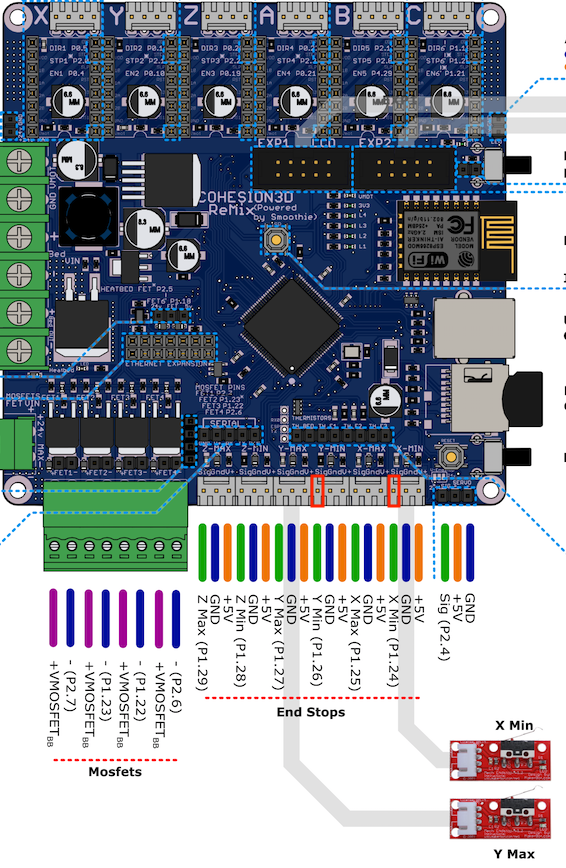

自从小豆子出生以来，一直没有时间，今天算是忙里偷闲，开始研究如何在 Cohesion3d-Remix 这块主控板上实现「无传感器归零」（sensorless homing)。所谓无传感器归零功能，使用的是 TMC2130 步进驱动的智能控制功能，可以根据步进电机失速的表现来对电机所处的状态进行分析。[^1]

# 固件设置

- 将 X, Y 方向的_归零回弹_ (home_bump) 设为 0

  ```c++
  #define X_HOME_BUMP_MM 0
  #define Y_HOME_BUMP_MM 0
  ```

- 开启 Sensorless_homing

  ```c++
  #define SENSORLESS_HOMING // TMC2130 only
  ```

  注意到后面有固件默认的归零敏感度：

  ```c++
  #if ENABLED(SENSORLESS_HOMING) || ENABLED(SENSORLESS_PROBING)
      #define X_STALL_SENSITIVITY  8
      #define Y_STALL_SENSITIVITY  8
      //#define Z_STALL_SENSITIVITY  8
    #endif
  ```

  将来可以使用 M914 X/Y/Z  去实时调整这个敏感度，不必再使用固件调整。

- 在 configuration.h 文件中找到 X_MIN_ENDSTOP , 将其设置为 true, Y 也同理

  ```c++
  // Mechanical endstop with COM to ground and NC to Signal uses "false" here (most common setup).
  #define X_MIN_ENDSTOP_INVERTING true // set to true to invert the logic of the endstop.
  #define Y_MIN_ENDSTOP_INVERTING true // set to true to invert the logic of the endstop.
  ```

# 硬件部分的改变

- 将 TMC2130 上的 Diag1 pin 与 C3D 板子上的限位开关 signal pin 连起来。我这里使用的是 X_MIN_ENDSTOP 和 Y_MIN_ENDSTOP，C3D 上的 pin 的位置见下图

# 上传固件

这一步是显然的。

#上电测试

[^1]:本文参考了 YouTube 视频：TMC2130 Guide - stepper motors driver upgrades part 3 - Sensorless homing <https://www.youtube.com/watch?v=OUadiW5QLBE>