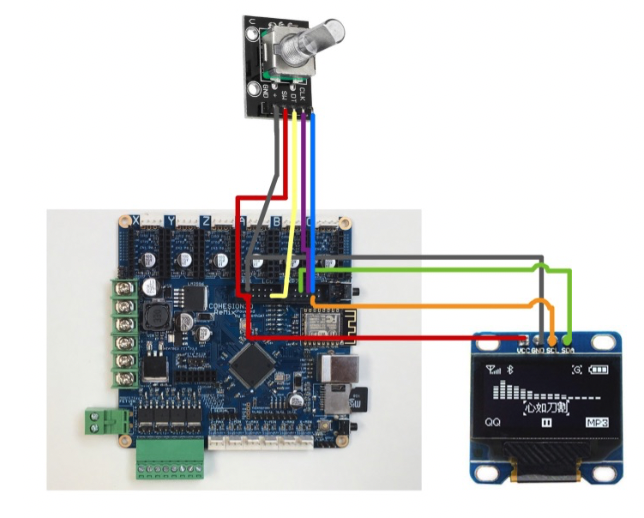

在多次的失望尝试之后，正如本文标题所述，我终于为 Cohesion3d-Remix
这块主板加上了一块屏幕和旋转编码器。当然，所用的并不是 Cohesion3d-Remix
（以下简称 C3D）的原生 Smoothieware 固件（曾经也多次尝试 Smoothie
的固件，但现在想想，它的 SPI 接口代码可能是有问题的），而是改用了 Marlin 2.0。

不要以为 Marlin是拥有最多用户的开源固件，就一定是最接近完美的。经我使用下来，发现 Marlin 2.0中的坑丝毫不比 Smoothieware 要少，但所幸 Marlin
会提供更丰富的接口种类（Smoothieware 甚至放弃了对 i2c接口的支持），代码的风格我也比较熟悉。下面就跟各位介绍介绍我是怎么爬完这些深坑的。

由于 C3D 板子上的 SPI 接口被我设成了软 SPI，如果要使用 SPI 接口的 OLED
屏就必须和 TMC2130 的 SPI 分享 SPI，这又得费一番周折；于是，我果断放弃了 SPI接口，转而考虑 i2c 接口。注意到 C3D 这块板子的主控芯片是 LPC1769 （32位），而在Marlin 的硬件抽象层 HAL 中封装了对 LPC1768(9) 系列的硬、软件 SPI，以及硬件 i2c的支持（软 i2c 还在开发中)，因此理论上我只要买一块支持 i2c
接口的显示屏，连到我的 C3D板子上预留的硬件i2c接口，一切都应该顺理成章地完成了。而且，i2c接口的数据连接线理论说只要两条数据线就够了。但现实并不是这样美好，第一个大坑就隐藏在i2c 的接口位置。

如果仔细查看 Marlin bugfix 2.0.x 的代码，可以发现，对不同类型的主板，Marlin
进行了封装（封装的意思就是具体的功能实现都放在 HAL（硬件抽象层）里面，外部预留的接口都是一致的。对 LPC1768 系列的 32 位板，HAL层有一个目录就称为 HAL_LPC1768。在这个目录之下，有个子目录u8g，这个目录就是负责图形图像的显示的。因此，我的 SH1106 OLED显示屏的一切相关操作，原则上说都应该在这个子目录里定义。

HAL 中的坑
==========

在 u8g 子目录中，有 HAL_LCD_I2C_routines.c 文件，此文件的作用是负责和 i2c slave设备的直接通信。即使作为非程序猿的我，稍加观察以后也发现了这个程序的问题：

```c++
uint8_t u8g_i2c_start(uint8_t sla) {  // send slave address and write bit
  // Sometimes TX data ACK or NAK status is returned.  That mean the start state didn't
  // happen which means only the value of the slave address was send.  Keep looping until
  // the slave address and write bit are actually sent.
  do{
    _I2C_Stop(I2CDEV_M); // output stop state on I2C bus
    _I2C_Start(I2CDEV_M); // output start state on I2C bus
    while ((I2C_status != I2C_I2STAT_M_TX_START)
        && (I2C_status != I2C_I2STAT_M_TX_RESTART)
        && (I2C_status != I2C_I2STAT_M_TX_DAT_ACK)
        && (I2C_status != I2C_I2STAT_M_TX_DAT_NACK));  //wait for start to be asserted

    LPC_I2C1->I2CONCLR = I2C_I2CONCLR_STAC; // clear start state before tansmitting slave address
    LPC_I2C1->I2DAT = I2CDEV_S_ADDR & I2C_I2DAT_BITMASK; // transmit slave address & write bit
    LPC_I2C1->I2CONSET = I2C_I2CONSET_AA;
    LPC_I2C1->I2CONCLR = I2C_I2CONCLR_SIC;
    while ((I2C_status != I2C_I2STAT_M_TX_SLAW_ACK)
        && (I2C_status != I2C_I2STAT_M_TX_SLAW_NACK)
        && (I2C_status != I2C_I2STAT_M_TX_DAT_ACK)
        && (I2C_status != I2C_I2STAT_M_TX_DAT_NACK));  //wait for slaw to finish
  }while ( (I2C_status == I2C_I2STAT_M_TX_DAT_ACK) ||  (I2C_status == I2C_I2STAT_M_TX_DAT_NACK));
  return 1;
}
```


看到没，这个函数的参数居然没有在函数体中被用到！这个函数的作用是将连接到主板的i2c 设备启动，显然，传递的参数是设备的地址，不知道地址怎么启动设备呢？

仔细再看，可以发现，除了这个问题之外，程序中段出现的 LPC_I2C1也很突兀。仔细一查，发现. LPC1768/1769 系列的芯片有三个硬件 i2c 接口，分别称为LPC_I2C0, LPC_I2C1,和 LPC_I2C2。在先前的代码 ：

```c++
#define U8G_I2C_OPT_FAST 16  // from u8g.h

#define USEDI2CDEV_M            1

#define I2CDEV_S_ADDR   0x78  // from SSD1306  //actual address is 0x3C - shift left 1 with LSB set to 0 to indicate write

#define BUFFER_SIZE                     0x1  // only do single byte transfers with LCDs

#if (USEDI2CDEV_M == 0)
  #define I2CDEV_M LPC_I2C0
#elif (USEDI2CDEV_M == 1)
  #define I2CDEV_M LPC_I2C1
#elif (USEDI2CDEV_M == 2)
  #define I2CDEV_M LPC_I2C2
#else
  #error "Master I2C device not defined!"
#endif

PINSEL_CFG_Type PinCfg;
I2C_M_SETUP_Type transferMCfg;

#define I2C_status (LPC_I2C1->I2STAT & I2C_STAT_CODE_BITMASK)
```

中其实提到了，USEDI2CDEV_M 这个变量可以决定选择用哪个 i2c接口。这下就明白了，原来 marlin 给我们留了个坑在这里！如果你的硬件 i2c没有选第一个接口，那么 99.999% 的可能性是你没法看到接入的 i2c设备能够正常运行了（因为所有的信息都会默认使用 LPC_I2C1 传输。）

看到这里，心里豁然开朗，因为稍稍改动一下，这部分的代码是可以纠正的。

具体的纠正，请见我的源代码仓库 (http://www.github.com/tigertooth4/)

纠正屏幕显示错乱的问题
======================

在成功让 i2c
的屏幕显示出文字后，我又发现了新的问题。当屏幕正常工作一段时间后，最后一行的文字会有一部分跑到屏幕的顶端去，然后就保持这个错乱的状态直到重新启动。上网搜索了一通，发现有个叫
obertr0n 的 GitHub 用户也有同样的问题，可惜的是当时我对 u8g
的代码还不够熟悉，没能注意到他的代码实际上可以解决我的问题。

于是，在继续在网上游游荡荡寻找了好久后，终于另一天另外一个 ＧitHub
用户也提出了这个问题。他发了一个 issue 后，获得了 Marlin
大佬的注意。这位用户在提出问题之后，就很快提出了解决方案，在 i2c 屏幕的 SDA, SCL
pin 上增加两个 pull-up 电阻。看到这个解决方法，我赶紧自学了一下 i2c bus 的
pull-up 电阻是什么，为什么需要它。然后直接翻出家里的 3k 电阻 pull-up
了一把，没想到屏幕一下子变黑不工作了。于是又在网上继续恶补了一下 pull-up
电阻的原理，发现 pull-up 电阻是有取值范围的。GitHub 上建议的 pull-up 电阻是
4.7k，但我家里现有的电阻没有这个阻值。于是我又尝试了一下 10k 和 5k
的电阻，兴奋的期待屏幕可以恢复正常。没想到，两个阻值的电阻都还是会出现屏幕错乱的问题。这两次失败让我非常失望。

回头又去翻看 GitHub 上关于这个 bug 的
issue，竟发现原来提出这个问题的那位网友也提到他下定论太早了， pull-up
电阻尝试也不能解决他的问题。惊喜之余又感到庆幸终于不是一个人在战斗了。Marlin
大佬建议看一下 u8g HAL
这部分的代码，尝试修改下，看看有什么后果，即使坏的结果也没所谓。于是我又把
HAL，u8g 这部分的逻辑重新捋了几遍。并尝试用基于 LPC1789 的 mbed 开发板的 i2c
代码对 Marlin 的 i2c 部分进行了检查，发现 Marlin
的这部分确实比较粗糙，有些函数中的分支判断并不完整。我把 mbed 开发板的 i2c
代码片段移植到 Marlin 后，发现仍然不能解决问题。于是，我又把思路转向了 u8g
部分，这部分是负责图形图像输出的。我研究了 Marlin 的 u8g
部分（这部分分散在几个文件中，例如 ultralcd.cpp,
ultra_dogm.cpp，等等）。我尝试注释掉了 u8g
的主循环中的两行代码，这两行代码会取消掉除 Splash
图像之外的所有图形输出。这么改了以后，屏幕的问题也消失了。那么，是不是能确定问题出现在
u8g 部分呢？另一个 GitHub 网友指出这并不能断定问题出现在
u8g，因为这时候只有一帧图像。

又过了几天，最开始的那位 GitHub 网友提到 obertr0n 的 Ｍarlin
可以解决屏幕错乱的问题，但是把 obertr0n 所改动的两个文件 -
`HAL_LCD_I2C_routines.c`  `u8g_com_HAL_LPC1768_ssd_hw_i2c.cpp` 贴到他的 Marlin
之后，屏幕依然存在问题，所以他怀疑他的 Marlin
的其它部分还有问题。我其实没太认真读他的帖子，惊喜之余，赶快拿出 FileMerge.app
，把 obertr0n 的 这两个文件和我的版本比较了一下，果然发现在
`u8g_com_HAL_LPC1768_ssd_hw_i2c.cpp` 中找到我的版本里面缺失了的两行：

```c++
case U8G_COM_MSG_ADDRESS:                     /* define cmd (arg_val = 0) or data mode (arg_val = 1) */
      u8g->pin_list[U8G_PI_A0_STATE] = arg_val;
      u8g->pin_list[U8G_PI_SET_A0] = 1;   /* force a0 to set again */
        // 缺失以下两行，需要添加上，以使屏幕正常显示
      u8g_i2c_start(0); // send slave address and write bit
      u8g_i2c_send_byte(arg_val ? 0x40 : 0x80);  // Write to ? Graphics DRAM mode : Command mode
```

贴到我的版本的 Marlin 之后，果然屏幕恢复正常了！

Encoder 的坑
============

原以为，屏幕的显示是最大的问题，解决了屏幕，配一个编码器不是个问题，没想到买来编码器按照
pin_Cohesion3d_remix.h 的针脚定义接好线以后，编码器并不工作。

经过对 Marlin 代码进一步研究后，发现 Marlin
的主屏幕就是显示状态，要想进入菜单，让编码器生效，我所定义的屏幕必须要定义过
HAS_LCD_MENU 这个宏。而支持这个宏的屏幕，必须是一块 ULTIPANEL。

于是，我在 Conditionals_LCD.h 文件中增加了两行代码：

```c++
#elif ANY(SH1106_STANDALONE,SSD1306_STANDALONE)
#define ULTIPANEL  // to enable rotary encoder (actually invoke NEWPANEL option)
```


这样定义后，编码器果然工作了。

最终的连线图
============



Marlin 代码
=================
见 [我的 Marlin ](https://github.com/tigertooth4/Marlin/tree/bugfix-2.0.x). 关于我对 Marlin 中代码修改的细节，将在今后的文章中进一步介绍。
