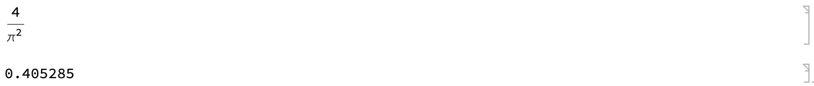
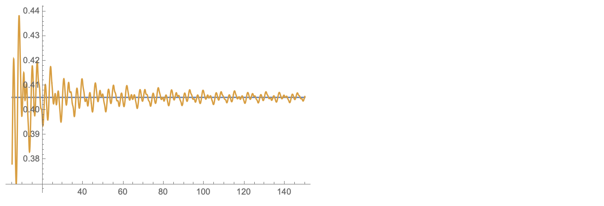
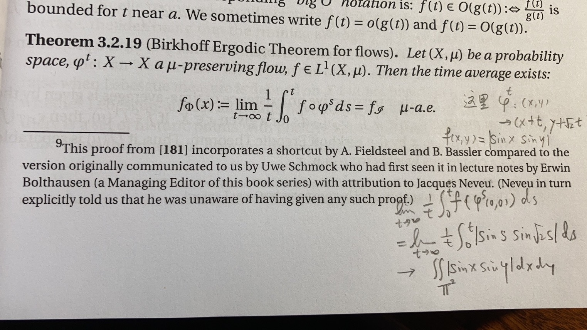

## 一道极限题

最近，在一个微信群里看到几个大佬在讨论一个极限题
$$
\lim\_{t\to+\infty}\frac1t \int_0^t |\sin(x)\sin(\sqrt2 x)|dx
$$
感觉挺有意思，于是就多想了一下。

最初的想法当然是洛必达法则，但立刻发现此路不通，因为分子部分的导函数在 $t\to+\infty$ 的时候显然没有极限（洛必达法则中，若求导后没有极限，是不能说明原来的问题没有极限的）。第一瓢冷水浇过后，便没了思路。积化和差、变量替换，这些统统行不通。被积函数也没呈现出确切的周期性。嗯，有趣，难度比想象的大不少啊！

## 答案和做法

顺手翻了下微信群里大佬们的讨论，发现大佬们的 MMA 用得炉火纯青。这里我就顺手摘抄下两句代码，读者们可以看看大佬是如何思考解决这个极限问题的。

```mathematica
Simplify@Integrate[Abs[Sin[x] Sin[Sqrt[2] x - t]], {x, 0, π}, {t, 0, π}]/π^2
N@%
```



```mathematica
fun = f /. 
   Last@NDSolve[{f'[x] == Abs[Sin[x] Sin[Sqrt[2] x]], f[0] == 0}, 
     f, {x, 0, 150}];
Plot[{4/π^2, fun[t]/t}, {t, 5, 150}, PlotRange -> All]
```



可以看出，数值积分的结果是趋向于 $4/\pi^2$ 的，对此，大佬们的解释如下

> 因为sqrt2是无理数，函数肯定会均匀遍历所有可能的值，令这个额外的变量为t，对单个周期进行积分就行了

对这个解释，我其实并没有看懂。隐约觉得解题的大佬估计是学物理的。没有看懂的原因是，不明白为什么在遍历存在的前提下，就可以引进新变量，把积分变成你两个单项的积分呢？

# 我的想法

放下手机，思索了很久。大佬说的确实有一些道理，比如遍历，但引进一个新变量并且把积分拆开我就不能马上理解了。考虑到两个被积函数的周期不可比，可否看成两个坐标方向各按周期进行运动呢？经验告诉我，可以考虑一个正方形区域上斜率是 $\sqrt{2}$ 的直线。而对 $x$ 进行积分是什么意思呢？显然，可以看成在直线上的第一型曲线积分；被积函数可以看成直线上点的线密度。而将被积函数写出两个自变量的形式，恰好可以看成正方形区域上有一个面密度 $|\sin(x)\sin(y)|$，它在直线 $y=\sqrt2 x$ 上的限制，恰好是直线上的线密度。有了这个想法，大佬们的解释在我看来就非常直观了，并且具有了物理意义！下面就是用这种我能接受的方式重新描述了一下这个问题。

> 假设在 $D=[0,\pi] \times [0,\pi]$ 上有一个非负连续函数 $f(x,y)$，把 $f$ 想象成这片区域的面密度，则这个区域的平均密度可以表示成 $\rho = \frac{\iint\_D f(x,y)dxdy}{\iint\_D dx dy}$。然后考虑一族在区域中稠密的平行线，例如想象区域 $D$ 的两组对边是分别等同起来，斜率为 $\sqrt{2}$ 或其它无理数的直线，从 $(0,0)$ 点开始在区域 $D$ 中，碰到 $D$ 的边界以后从它的对边冒出来再继续沿 $\sqrt{2}$ 前进。
>
> 假设这些直线上每一点 $(x,y)$ 的线密度就等于 $f(x,y)$，那么可以考虑每段这样的线的质量，例如第 $n$ 段直线段的质量等于 $M\_n = \int f(x,y)dl$，它的长度等于 $l\_n = \int dl$ ，如果我考虑所有这些直线的质量和除以长度和，得到的平均密度 $d = \lim\_{N\to+\infty} \frac{\sum\_{n=1}^N M\_n}{\sum\_{n=1}^N l\_n}$。问：$d=\rho$ 吗？

# 另一位大佬的解释

从物理角度，感觉答案确实应是相等。但如何证明，我却没有思路。于是，请教了身边另一位大佬，他说，这个很像是 Birkhoff 遍历定理，用这个定理就可以看出 $d=\rho$。他翻了下手边一本叫 Hyperbolic Flows 的书，并在书的空白处写了下推导过程，如下。



这里 $f\_\mathscr{I}$ 是这个保测度流的不变集的平均密度，对于 $\varphi^s$ 来说，每条轨道（稠密的平行线）都是一个不变集，总的不变集就是正方形区域本身。至此，问题顺利解决了！

这么一道计算极限的问题，居然可以和这么高深的数学工具联系到一起，真是令人惊叹不已！

# 续

那么，问题来了。

1. 这样一道极限问题，有没有初等的证明方法呢？
2. 如果考虑的不是 $\sqrt2$，而是有理数，那么结果该是多少呢？
3. 或者，如果考虑三个三角函数的乘积，其自变量前的系数是三个有理数线性无关的无理数，那么极限又该是多少呢？ 

等我有空再想想吧！