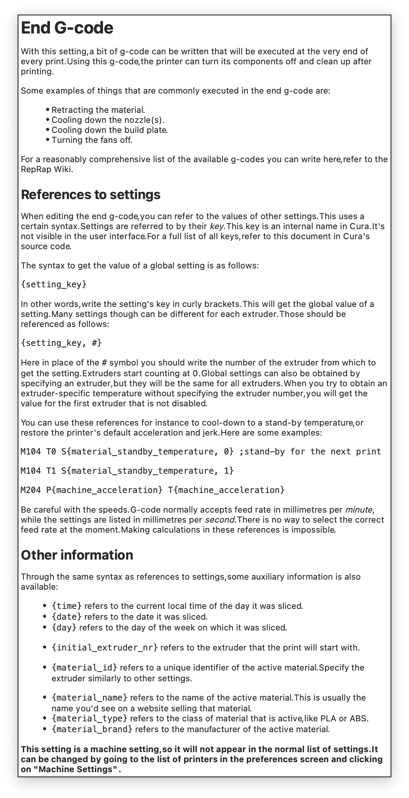

# 简介

在进行双喷头打印的时候，切片是重要一步。几年前，我的默认切片软件一直是 Cura，但是双头打印却有好几年没玩过了。最近，因为开发的原因重新开始研究双头，发现 Cura 还是最熟悉的工具。不过，经过了几年，Cura 已经大大进步了。于是，有需要重新研究一下。

今早进行双头打印的时候，我发现无论怎么切片，都是只有第二个喷头在打印。检查的结果让我怀疑是我设置的起始代码有问题。于是就有了下面的讨论。

# Start G-code


起始代码部分，Cura 会自动启动加热命令，在 g-code 起始代码前。但亲测发现还是可以在起始代码中自定义加热方式，并且 Cura 若看到了起始代码中的自定加热命令后，便不会自动在起始代码前加入加热命令。怀疑自动加热的功能是对 Ultimaker 机型说的。

这里我们要使用 `{initial_extruder_nr}` 来指定最初加热的喷嘴编号（喷嘴编号是从 0 开始的）。如下是我目前的起始代码：

```bash
; Custom Start G-code Written by XJ 

G28 ; Home axis while heating
G1 Z10 F3000 ; Move Z Axis up little to prevent scratching of Heat Bed

T{initial_extruder_nr} ; Switch to the tool that should start with 

M140 S{material_bed_temperature_layer_0} ; Heating bed to the initial temp
M190 S{material_bed_temperature_layer_0} ; Wait for bed temp to reach
M104 T{initial_extruder_nr} S{material_print_temperature_layer_0}; Heating up the tool 
M109 T{initial_extruder_nr} S{material_print_temperature_layer_0}; Wait for the tool

G1 X40 Y30 Z0.3 F3000.0 ; Move to start position
G92 E0 ; Reset Extruder
G1 X200 Y30 Z0.3 F1500.0 E15 ; Draw the first line
G1 X200 Y30.5 Z0.3 F3000.0 ; Move to inside a little
G1 X40 Y30.5 Z0.3 F1500.0 E25 ; Draw the second line
G1 X45 Y30.5 Z0.3 F1500.0 ; Draw the second line without filament
G92 E0 ; Reset Extruder

G1 Z3.0 F3000 ; Move Z Axis up little to prevent scratching of Heat Bed
```

检查发现，上述 G-代码不会生成正确的 `{initial_extruder_nr}`, 至少对 Cura 4.13.1 不会，除非明确在 Cura 中设置了首先使用的是哪个挤出机（比如增加 skirt，设置其使用第一个挤出机）。以下是 Cura 中关于 `{initial_extruder_nr}` 相关部分的代码。

[Cura/StartSliceJob.py at 6a053a9f46c56a94cfaf611cb55376b4d0ad09d1 · Ultimaker/Cura](https://github.com/Ultimaker/Cura/blob/6a053a9f46c56a94cfaf611cb55376b4d0ad09d1/plugins/CuraEngineBackend/StartSliceJob.py#L275-L283)

## 一些解决 `{initial_extruder_nr}` 问题的方法

Cura 总是在用户定义的**起始代码前**加入切换挤出机的命令 `T[nr]`，并且切换是在**归零之前。但是，Marlin** 固件中的设定是，若没有归零，则无法切换挤出机。这样，`T[nr]` 实际上并没有执行，在后续加热、打印过程中会产生一系列问题。目前不知道官方的解决方法是什么，我的想法是

### 1. 方式一 （Keep Everything Simple，目前我采取的方式）

- 在 Marlin 固件里，除非没有归零，否则总是执行实际切换（即使 `old_tool = active_tool`）。
- G28 命令如果对 X 方向进行了归零，则总是将 `active_extruder` 设为 0（默认等效于执行了一次 `T0` 命令）
- 在切片时，需要对第一个 Cura 生成的实际打印的操作**明确指定**一个挤出机，例如对 skirt（这是实际打印的第一部分）设定使用 `extruder_0` 或者 `extruder_1` 。

这样在 Cura 的起始代码部分，就可以随心所欲设定加热顺序和清理喷嘴的操作，并获得正确的 `{initial_extruder_nr}` 了。

### 2. 方式二（Home keeping track of the active_extruder，但很可能难以实现）

利用 Marlin 官方设定的机制，就是若在 `active_extruder <> 0` 的情况下，G28 会先做归零操作，然后切换回 `active_extruder` 和其所在的原始位置。

1. Cura 会自动在自定起始代码开始之前加入 `T[nr]`，切换到将要使用的挤出机，然后执行归零操作，这时，如果机器是刚打开的，各方向坐标未知，则这条切换指令将被固件跳过，所以，当前的挤出机可能为缺省挤出机 `extruder_0`. 我们是否可以在固件中修改 tool_change 的代码，让其在 X 方向未归零的前提下仍执行切换呢？*可以，但这会增加编程难度*）。
2. 倘若上一步切换操作成功了了，我们已经切换到了 `active_extruder`，然后在起始代码中，我们是可以随意执行 G28 归零指令的，因为归零后 Marlin 会再执行一次切换操作，切换到之前的 `active_extruder`
3. 这时候，在起始代码中的一切加热指令，均不用设置对哪个挤出机加热（因为默认的就是对当前的 active_extruder 进行加热)，因此 `{initial_extruder_nr}` 参数都无需使用。所有的起始代码设置都可以如同单头打印机一样设置。
4. 为使 a. 步骤中的 `T[nr]` 能够正确执行，或许一种简单的方法是在每个 G-code 文件执行之前先加入 G28 命令，这或许可以通过 octoprint 的插件实现。

## End G-code



这是我目前的结束代码

```bash
M104 T0 S0
M104 T1 S0
M140 S0

;Retract the filament
G92 E0
G1 E-2 F300
T0 ; back to the first tool
G28 X0 Y0
M84
```
