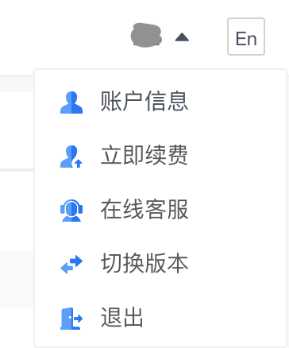

前几天在电脑上使用 Notability 客户端批量修改笔记名称的时候，曾一度出现了 notability 笔记全部丢失的情况。所幸的是 iPad 上显示一切正常，赶紧把 iPad 的笔记同步到 iCloud 后才松了口气。忽然想到曾经在网上看到别人也有过笔记全部消失的经历，立刻体会到了双重备份的必要性。翻阅了 Natability 提供的备份选项之后，决定使用坚果云的 WebDAV 进行备份。趁着放假，今天终于有时间把过程记录一下，一遍今后参考。

# 一、在坚果云中新建应用

1. 打开[坚果云](http://jianguoyun.com)网站，在网页右上角找到个人的账户信息设置。
  
    
    
2. 找到「安全选项」标签页。
  
    
    
3. 在右侧第三方应用管理里面，选择「添加应用」。
  
    
    
4. 填写要添加的应用名称，比如 notability，并点「生成密码」
  
    
    
5. 看到生成的密码以后，点击「复制」拷贝到剪贴板，或直接点击「完成」（将来可以在应用列表中查询密码）。
  
    
    

# 二、在 Notability 应用中设置自动备份到 WebDAV

1. 打开 Notability，点击「设置」（齿轮按钮）
  
    
    
2. 选择「自动备份」，自动备份的方式选 WebDAV，WebDAV 的地址选 [https://dav.jianguoyun.com/dav/](https://dav.jianguoyun.com/dav/) ，WebDAV 用户名写自己的坚果云账户名称（见下图），WebDAV 密码要填写刚生成的 notability 应用密码（可点击「显示密码」查询）。
  
    
    
3. 完成！坚果云会自动生成一个 notability 文件夹，并开始备份。

# 参考资料

- 坚果云的官方帮助文档：[Notability如何与坚果云进行连接自动备份？](https://help.jianguoyun.com/?p=3731)
