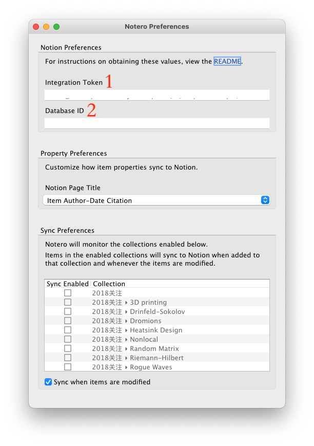
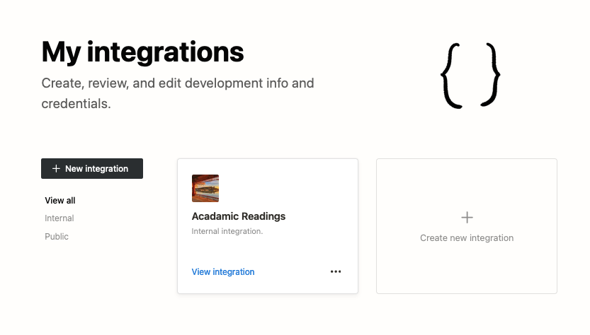

# 前言

Zotero 是文献管理利器。Notion 是第二大脑。那么二者能否结合起来，最大程度地提高生产效率呢？周末我突然想到这个问题，网上搜了一下，还真有现成的工具，把 Zotero 关注的文献信息同步到 Notion 中去, 这个工具是一个 Zotero 的插件，叫做 [**Notero](https://github.com/dvanoni/notero)**。

# 如何使用 Notero 同步文献信息到 Notion

Notero 可以把 Zotero 中指定的 collection 中的文献所做的更改同步到 Notion 的指定 database 中，为了实现这个功能，要做如下步骤的设置.

### 1. Zotero 端：安装 Notero 插件

在 Notero 的 github [页面](https://github.com/dvanoni/notero) 下载 .xpi 文件，然后打开 Zotero ，到 Tools 菜单的 add ons, 安装 notero.xpi 文件并重启 Zotero 即可. 回到 Zotero 以后，若安装插件是成功的，就可以看到 Tools 菜单里面多了一个 Notero Preferences, 点开以后就有一个对话框，类似下图

Notero 插件的 Preferences

### 2. 中介 Notion-Integration 的设置

打开[网页](https://www.notion.so/Notion-43d3c8309fb042b4a2c67f0786949d5f)，如果已经登录了 Notion 账号的话，看到的是这样的页面

点击 Create new integration, 可以创建一个新的 integration, 输入想要建立的 integration 的名称（可以任意）

后面的选项可以按自己的需求选取，最后点击 Submit，就会看到这里有个 Internal Integration Token，将这个 Token 记录在记事本或其它文本编辑程序里面以备后续使用，检查一切无误以后可以点击 Save changes.

这样一个 Notion-Integration 就创建好了. 这个 Internal-Integration Token 将来要填到 Zotero 的 Notero 插件 Preferences 的 Integration Token 位置（见 Notero References 图中 位置 1）。

### 3. 在 Notion 中选定一个想要同步到的 database.

这一步我复制了 Notero 提供的现成的 [Notero Advanced Database](https://www.notion.so/79b17005bc374209b0f373b1a3cde0ae)

只要点击右上角的 Duplicate，就可以复制到自己的 notion workspace 中来。复制过来后，记得点击数据库最右上角的 … ，并在下拉菜单中选取 Copy Link，这个链接形如

这里的 Database ID 部分要填到 Notero 插件 Preferences 的 Database ID 栏（见 Notero References 图中位置 2）。

### 4. Zotero 中的设置

将收集的 Integration Token 和 Database ID 都填到 Tools > Notero Preferences 中，并选择 Zotero 想要同步到 Notion 中去的 Collection，我这里是名为 Currently Reading 的一个新建的 Collection.

### 5. 最后一步，将 Notion 的 database 和中介 Notion-Integration 连接起来.

这一步，需要点击 database 页面最右上角的 … ，选择 Add connections> 找到你刚建立的 notion-integration 的名称，并点击添加。

好了，大功告成！可以往 collection 里面添加文献看看会不会出现在 notion 里了 ?

# 参考资料

1. Notero Github [GitHub - dvanoni/notero: A Zotero plugin for syncing items into Notion](https://github.com/dvanoni/notero)
2. YouTube: Sync Zotero to Notion to Level-Up Your Academic Research | AWESOME Notion Plug-In | Notion Tutorial, [Sync Zotero to Notion to Level-Up Your Academic Research | AWESOME Notion Plug-In | Notion Tutorial - YouTube](https://www.youtube.com/watch?v=8IC8-mPbjCo)
