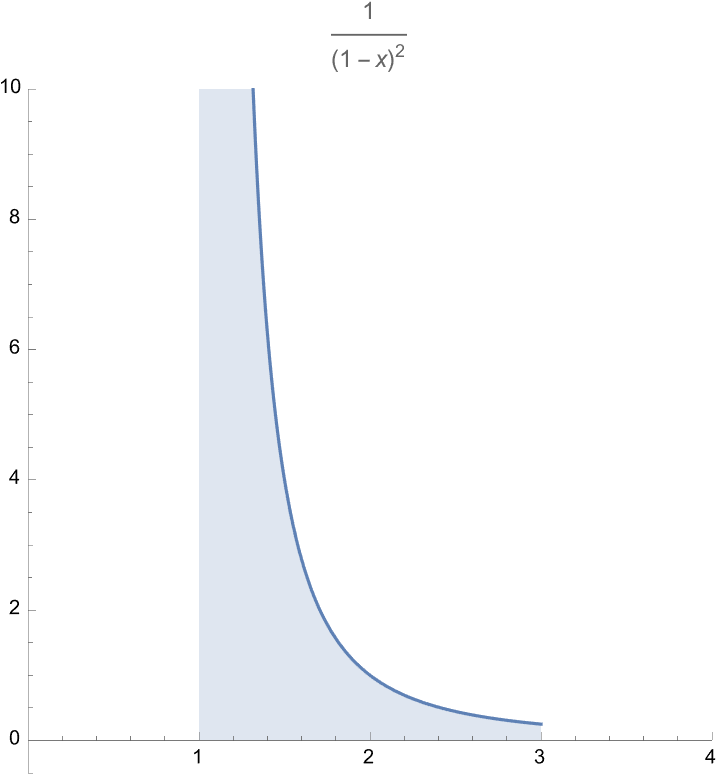
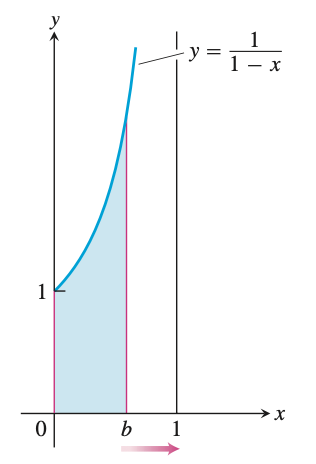

周次: 8
备注: Attendance check
日期: April 13, 2022
节次: 1

In this lecture, we consider integrals when the domain of integration is infinite, or the range of the integrand is infinite. Such cases are not Riemann integrable, therefore, they are called **improper integrals**. We would like to manage the integrations for these cases, via some limit procedure.

# Outline

- Improper Integrals of Type I 
- Improper Integrals of Type II
- The Convergence Tests

# Preliminary Examples

### Example (a). An integral defined on an infinite domain

$$
\int_1^{\infty}{\ln(x)\over x^2}dx,
$$
is integrated on $[1,+\infty)$.

### Example (b). The range of the integrand is infinite

$$
\int_0^1 \dfrac{1}{\sqrt{x}}dx
$$
is integrated on $[0,1]$, where the integrand is unbounded.

# Infinite Limits of Integration

## Type I Improper Integrals

**Definition. Integrals with infinite limits of integration, i.e.**
$$
		\int_a^{\infty}f(x) dx,\quad\int_{-\infty}^b f(x)dx,\quad 
		\int_{-\infty}^\infty f(x)dx
$$
are **improper integrals of Type I.** 

**NOTE.** The integrand $f(x)$ is considered **integrable** on every bounded sub-interval.

➡️ If $f(x)$ is continuous on $[a,\infty)$ , then the improper integral is defined by 
$$
\int_a^\infty f(x) dx := \lim_{b\to+\infty}\int_a^b f(x)dx.
$$

-  If the limit exists,  we say that the improper integral _converges_ and that the limit is the _value_ of the improper integral.
-  If the limit fails to exist, the improper integral _diverges_. 

### Example. The region lies under the curve $y=e^{-x/2}$ in the first quadrant.

➡️ If $f(x)$ is continuous on $(-\infty,b]$, then the improper integral is given by 

$$
\int_{\infty}^b f(x) dx := \lim_{a\to-\infty}\int_a^b f(x)dx.
$$

-  If the limit exists,  we say that the improper integral _converges_ and that the limit is the _value_ of the improper integral.
-  If the limit fails to exist, the improper integral _diverges_. 

➡️ If $f(x)$ is continous on $(-\infty,+\infty)$, then 

$$
\int_{-\infty}^\infty f(x)dx := \int_{-\infty}^c f(x)dx + \int_c^\infty f(x)d x
$$

where $c$ is any real number. 

-  If _BOTH_ the limits exist,  we say that the improper integral _converges_ and that the sum of  limits is the _value_ of the improper integral.
-  If _ANY_ of the limits fails to exist, the improper integral _diverges_. 

**Note** It can be shown that the choices of $c$ is unimportant. We can evaluate or determine the convergence or divergence of $\int_{-\infty}^\infty f(x) dx$ with any convenient choice.

### Example 1. Evaluating an Improper Integral on $[1,+\infty)$

Find the area under the curve $y=\ln(x)/x^2$ from $x=1$ to $x=\infty$, is it finite? If so, what is it?

### Example 2. Evaluating an Integral on $(-\infty,+\infty)$

Evaluate 

$$
\int_{-\infty}^\infty \dfrac{dx}{1+x^2}.
$$

## The Integral $\int_{a}^\infty \frac{1}{x^p} dx$ ($a>0$)

### Example 3. Determining Convergence

For what values of $p$ does the integral $\int_1^\infty\frac{1}{x^p}dx$ converge? When it converges, what is its value?

# Integrands with Vertical Asymptotes

Another type of improper integral arises when the integrand has a vertical asymptote — an infinite discontinuity — at a limit of integration or at some point between the limits of integration. 

### Example

Consider the region in the first quadrant that lies under the curve $y=1/\sqrt{x}$ from $x=0$ to $x=1$. 

## Type II Improper Integrals

**Definition. Integrals of functions that becomes infinite at a point within the interval of integration are _Improper integrals of Type II_ .**

➡️ If $f(x)$ is continuous on $(a,b]$ and is discontinuous at $a$ then 

$$
\int_a^b f(x)dx := \lim_{h\to 0^+}\int_{a+h}^b f(x)dx.
$$

-  If the limit is finite we say the improper integral _converges_ and that the limit is the _value_  of the improper integral. 
-  If the limit does not exist, the integral _diverges_ .

➡️ If $f(x)$ is continuous on $[a,b)$ and is discontinuous at $b$, then 

$$
\int_a^b f(x)dx :=\lim_{h\to0^+}\int_a^{b-h}f(x)dx.
$$

-  If the limit is finite we say the improper integral _converges_ and that the limit is the _value_  of the improper integral. 
-  If the limit does not exist, the integral _diverges_ .

➡️ If $f(x)$ is discontinuous at $c$, where $a<c<b$, and continuous on $[a,c)\cup (c,b]$, then 

$$
\int_a^bf(x)dx :=\lim_{h\to0^+}\int_a^{c-h} f(x)dx + \lim_{s\to0^+}\int_{c+s}^b f(x)dx.
$$

- If the limits are _BOTH_ finite we say the improper integral **converges** and that the limit is the **value** of the improper integral. 
- If _ANY_ of the limit does not exist, the integral **diverges**.

### Example 4. A Divergent Improper Integral

Investigate the convergence of 

$$
\int_0^1 \dfrac{1}{1-x}dx.
$$

### Example 5. Vertical Asymptote at an Interior Point

Evaluate 

$$
\int_0^3 \dfrac{dx}{(x-1)^{2/3}}dx
$$

### Example 6. A Convergent Improper integral

Evaluate

$$
\int_2^\infty \dfrac{x+3}{(x-1)(x^2+1)}dx.
$$

### Example 7. Finding the Volume of an Infinite Solid

The cross-sections of the solid horn in this graph perpendicular to the $x$-axis are circular disks with diameters reaching from the $x$-axis to the curve $y=e^x$, $-\infty<x\le \ln2.$ Find the volume of the horn.

### Example 8. An Incorrect Calculation

$$
\int_0^3 \dfrac{dx}{x-1} = \ln |x-1|\bigg]_{0}^3 = \ln 2- \ln 1 = \ln 2.
$$

This example illustrates what can go wrong if you mistake an improper integral for an ordinary integral. Whenever you encounter an integral $\int_a^b f(x)dx$  you **MUST** examine the function $f$ on $[a,b]$ and then decide if the integral is improper. If $f$ is continuous on $[a,b]$, it will be proper, an ordinary integral.

# Test for Convergence and Divergence

Sometimes, the integral might be very hard to evaluate directly. A good strategy is trying to determine whether it converges or diverges. Then if it is converges, we can evaluate numerically to get an approximation at least. 

The principal tests for convergence of divergence are the **Direct Comparison Test** and the **Limit Comparison Test.**

**Note**  The comparison tests only work for non-negative or non-positive functions.

### Example 9. Investigating Convergence

Does the integral $\int_1^\infty e^{-x^2}dx$ converge? 

## Theorem 1. Direct Comparison Test

Let $f$ and $g$ be continuous on $[a,+\infty)$ with $0\le f(x)\le g(x)$ for all $x\ge a$. Then 

- $\int_a^\infty f(x)dx$  converges if $\int_a^\infty g(x)dx$ does,
- $\int_a^\infty g(x)dx$ diverges if $\int_a^\infty f(x)dx$  does.

**Proof.**

### Example 10. Using the Direct Comparison Test

$$
(a)\qquad\qquad\qquad \int_1^\infty \dfrac{\sin^2 x}{x^2} dx\quad \text{converges}
$$

$$
(b) \qquad\qquad\qquad\int_1^\infty \dfrac{1}{\sqrt{x^2-0.1}}dx\qquad \text{diverges}
$$

## Theorem 2. Limit Comparison Test

If the positive functions $f$ and $g$ are continuous on $[a,+\infty)$ and if 

$$
\lim_{x\to+\infty}\dfrac{f(x)}{g(x)} = L,\qquad 0<L<\infty ,
$$

then 

$$
\int_a^\infty f(x)dx\quad \text{and} \quad \int_a^\infty g(x)dx 
$$

both converge or both diverge.

**Sketch for the proof.**

### Example 11. Using the Limit Comparison Test

Show that 

$$
\int_1^\infty \dfrac{dx}{1+x^2}
$$

converges by comparison with $\int_1^\infty \frac{dx}{x^2}$. Find and compare the two integral values.

### Example 12. using the Limit Comparison Test

Show that 

$$
\int_1^\infty \dfrac{3}{e^x+5}dx
$$

converges.